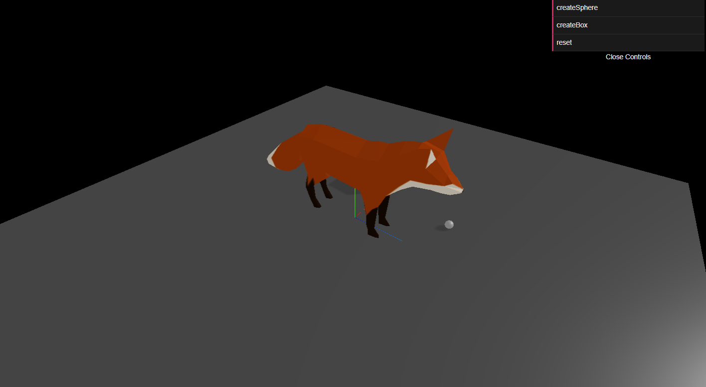

# A Three.js Game
This is a game engine been built Using Three.js, And Physics Library Cannon.js. You can play the simulation in this [address](https://a-threejs-game-production.up.railway.app/). The snapshot of the game is shown in the picture below.

## How to play
It is preferred to open the game using a PC. You can move the fox using the "W-S-A-D" keys. You can also insert boxes and spheres with random dimensions using the buttons on the right top side of the screen. The boxes and spheres are spawned on the top of the center of the world.